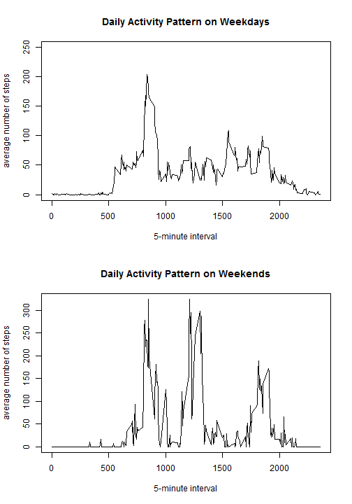

#Reproducible Research - Project Assignment 1

Xiukun Zhao

## Introduction

This assignment makes use of data from a personal activity monitoring device. This device collects data at 5 minute intervals through out the day. The data consists of two months of data from an anonymous individual collected during the months of October and November, 2012 and include the number of steps taken in 5 minute intervals each day.

This document presents the results of Project Assignment 1 in the Coursera course Reproducible Research.
In this document, code will be represented to show how the results have been achieved. Set the default of echo to be true throughout the document:


```r
library(knitr)
opts_chunk$set(echo = TRUE)
```

## Loading and preprocessing the data

1. Load the data 

2. Check the data with str() and head()


```r
data <- read.csv(file="activity.csv")
str(data)
```

```
## 'data.frame':	17568 obs. of  3 variables:
##  $ steps   : int  NA NA NA NA NA NA NA NA NA NA ...
##  $ date    : Factor w/ 61 levels "10/1/2012","10/10/2012",..: 1 1 1 1 1 1 1 1 1 1 ...
##  $ interval: int  0 5 10 15 20 25 30 35 40 45 ...
```

```r
head(data)
```

```
##   steps      date interval
## 1    NA 10/1/2012        0
## 2    NA 10/1/2012        5
## 3    NA 10/1/2012       10
## 4    NA 10/1/2012       15
## 5    NA 10/1/2012       20
## 6    NA 10/1/2012       25
```

# What is mean total number of steps taken per day?

For this part of the assignment, you can ignore the missing values in the dataset.

1. Make a histogram of the total number of steps taken each day

2. Calculate and report the mean and median total number of steps taken per day


```r
data_ignoreNAs <- data[which(!is.na(data$steps)),]
perday <- tapply(data_ignoreNAs$steps, data_ignoreNAs$date, sum)
hist(perday,20, main = "Total number of steps taken per day", xlab = "Steps per day")
```


```r
mean_ignoreNAs <- mean(perday, na.rm = TRUE)
median_ignoreNAs <- median(perday, na.rm = TRUE)
mean_ignoreNAs
```

```
## [1] 10766.19
```

```r
median_ignoreNAs
```

```
## [1] 10765
```

The mean total number of steps per day is 1.0766189 &times; 10<sup>4</sup>, while the median of the total steps per day is 10765.

## What is the average daily activity pattern?

1. Make a time series plot of the 5-minute interval (x-axis) and the average number of steps taken, averaged across all days (y-axis)

2. Which 5-minute interval, on average across all the days in the dataset, contains the maximum number of steps?


```r
dailypattern <- tapply(data_ignoreNAs$steps, data_ignoreNAs$interval, mean)
plot(y = dailypattern, x = names(dailypattern), type = "l", xlab = "5-minute interval", 
    main = "Daily Activity Pattern", ylab = "average number of steps")
```


```r
interval_max <- dailypattern[dailypattern == max(dailypattern)]
interval_max
```

```
##      835 
## 206.1698
```

The interval with the maximum average number of steps throughout the days is 835 with 206.1698113 steps.

# Imputing missing values

Note that there are a number of days/intervals where there are missing values (coded as NA). The presence of missing days may introduce bias into some calculations or summaries of the data.

1. Calculate and report the total number of missing values in the dataset 

2. Devise a strategy for filling in all of the missing values in the dataset. Here, we use the mean of thet 5-minute interval.

3. Create a new dataset that is equal to the original dataset but with the missing data filled in.

4. Make a histogram of the total number of steps taken each day and Calculate and report the mean and median total number of steps taken per day. 


```r
data_na <- sum(is.na(data$steps))
data_new <- data
data_new[which(is.na(data_new$steps)), 1] <-
        dailypattern[as.character(data_new[which(is.na(data_new$steps)), 3])]
datanew_na <- sum(is.na(data_new$steps))
data_na
```

```
## [1] 2304
```

```r
datanew_na
```

```
## [1] 0
```

2304 missing values are filled now.Let us make the same histogram, which we made in the first part of the analysis.


```r
perday_new <- tapply(data_new$steps, data_new$date, sum)
par(mfrow = c(2,1))
hist(perday, 20, main = "Histogram of steps per day", xlab = "Steps per day"
     , ylim = c(0, 20))
hist(perday_new,20, main = "Histogram of  of steps per day  
     (missing values replaced with mean of interval)", xlab = "Steps per day",
     ylim = c(0, 20))
```


We now calculate the median and the mean of the filled in dataset.


```r
mean(perday_new)
```

```
## [1] 10766.19
```

```r
median(perday_new)
```

```
## [1] 10766.19
```

The impact of inputting missing data is minimal, as only the median seems to be changing but by just over one step.

# Are there differences in activity patterns between weekdays and weekends?

1. Create a new factor variable in the dataset with two levels -- "weekday" and "weekend" indicating whether a given date is a weekday or weekend day.

2. Make a panel plot containing a time series plot (i.e. type = "l") of the 5-minute interval (x-axis) and the average number of steps taken, averaged across all weekday days or weekend days (y-axis). 


```r
data_new$weekdayType <- ifelse(weekdays(as.Date(data_new$date)) %in% c("Satuday", "Sunday"), 
    "weekend", "weekday")
head(data_new)
```

```
##       steps      date interval weekdayType
## 1 1.7169811 10/1/2012        0     weekday
## 2 0.3396226 10/1/2012        5     weekday
## 3 0.1320755 10/1/2012       10     weekday
## 4 0.1509434 10/1/2012       15     weekday
## 5 0.0754717 10/1/2012       20     weekday
## 6 2.0943396 10/1/2012       25     weekday
```


```r
data_new_we <- subset(data_new, weekdayType == "weekend") 
data_new_wd <- subset(data_new, weekdayType == "weekday") 
dailypattern_we <- tapply(data_new_we$steps, data_new_we$interval, mean)
dailypattern_wd <- tapply(data_new_wd$steps, data_new_wd$interval, mean)
par(mfrow=c(2,1))
plot(y = dailypattern_wd, x = names(dailypattern_wd), type = "l", xlab = "5-minute interval", 
     main = "Daily Activity Pattern on Weekdays", ylab = "average number of steps", 
     ylim =c(0, 250))
plot(y = dailypattern_we, x = names(dailypattern_we), type = "l", xlab = "5-minute interval", 
     main = "Daily Activity Pattern on Weekends", ylab = "average number of steps")
```


    
There here are a lot of differences between weekdays and weekends. People tend to wake up later on weekends.

